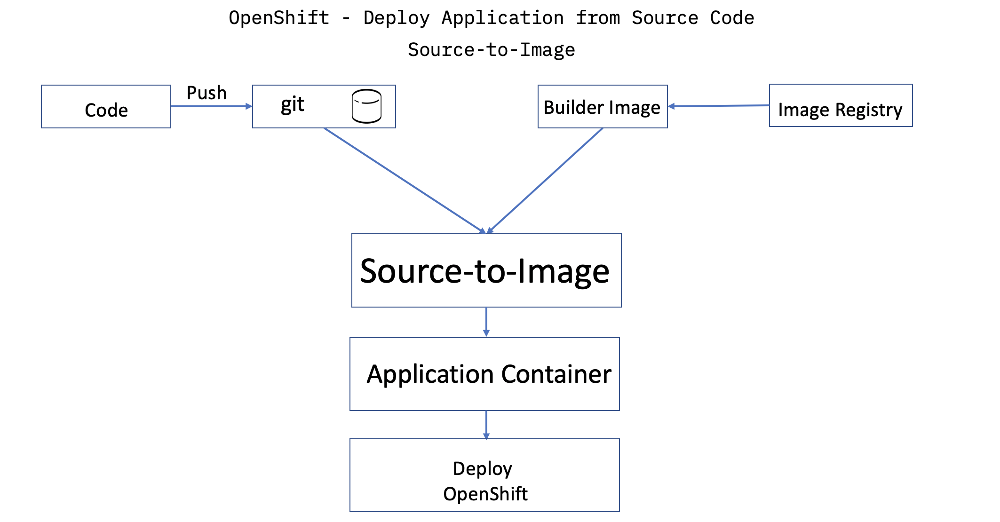
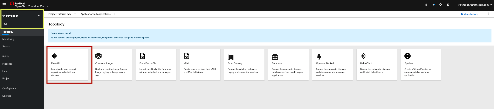
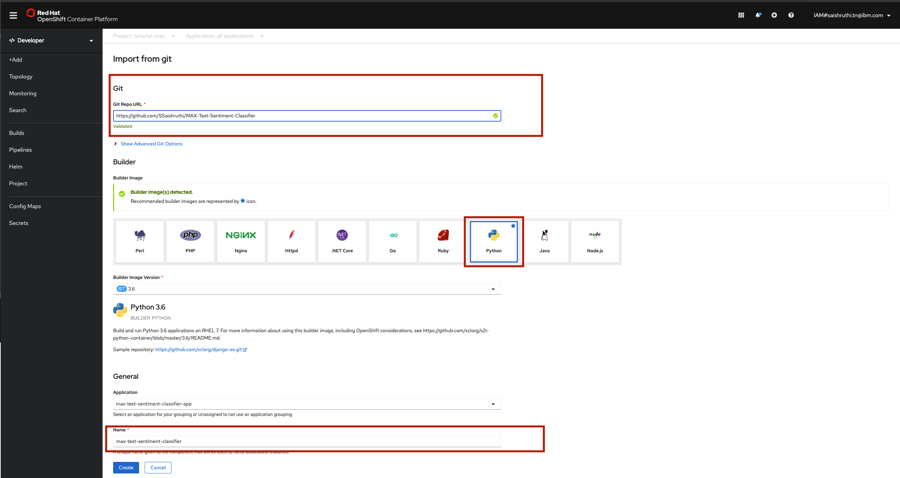
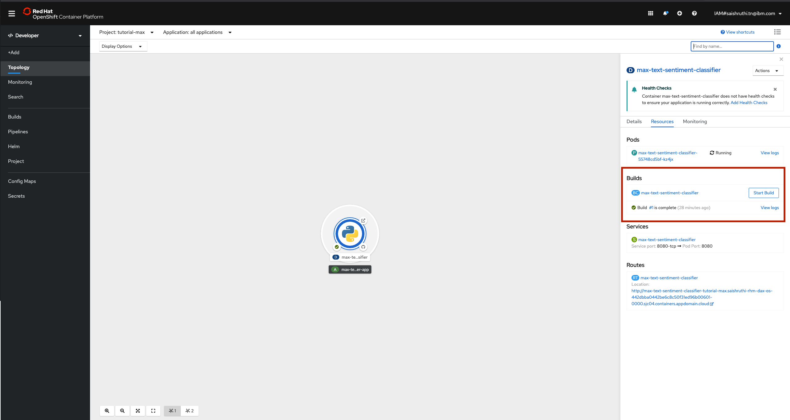
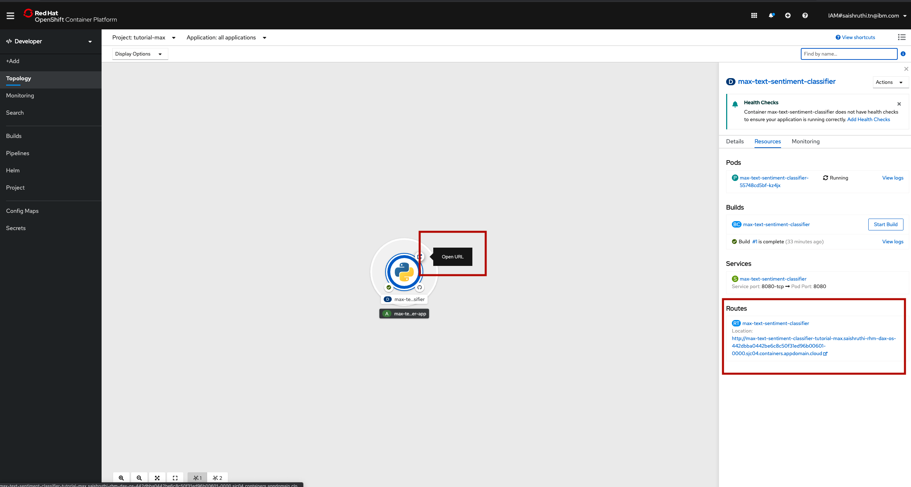

# Detect the sentiment of text.

This tutorial walks you through the process to build and deploy a deep learning model as a microservice using MAX Framework and OpenShift Technologies.

# Pre-requisite

- Follow the process provided in the [MAX-Skeleton](https://github.com/IBM/MAX-Skeleton) to provide REST API to the your model inference code.
- Basics of docker
- OpenShift

# What is Source-to-Image(S2I)?

Source-to-Image is a toolkit and workflow for building reproducible container images from the source code. S2I produces ready-to-run docker images by injecting source code into a container image and letting the conainer prepare that source code for execution.



# Steps

- Create a folder `.s2i` and add an file `environment`.
- Update the `environment` file with the script name you wish to run to start your application. Here it is `app.py`. Copy the below code in the file:
```
APP_FILE=app.py
```
- Login to your OpenShift cluster and open the web console
- Go to `Developer` view and click on `+Add`. We will be building the image from the source code stored in `Git`. Select `From Git`.

- Provide link to the source code stored in the git. Tool can automatically detect the builder image, make sure `Python` is selected. Provide name for the application and click `Create`.

- Application will start to build. You can view the logs by clicking on `View Logs`.

- Once built, click on the route and launch the application.


